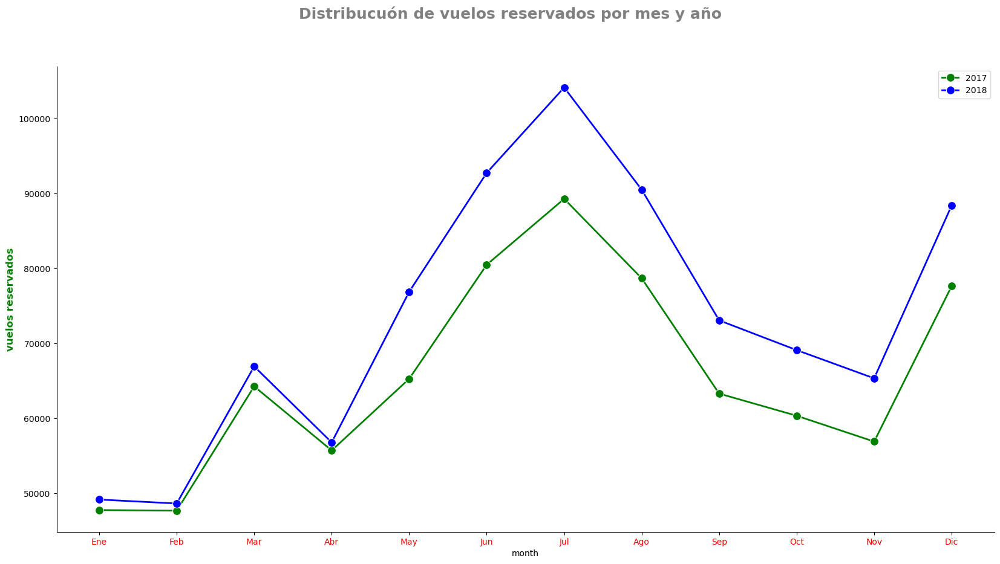
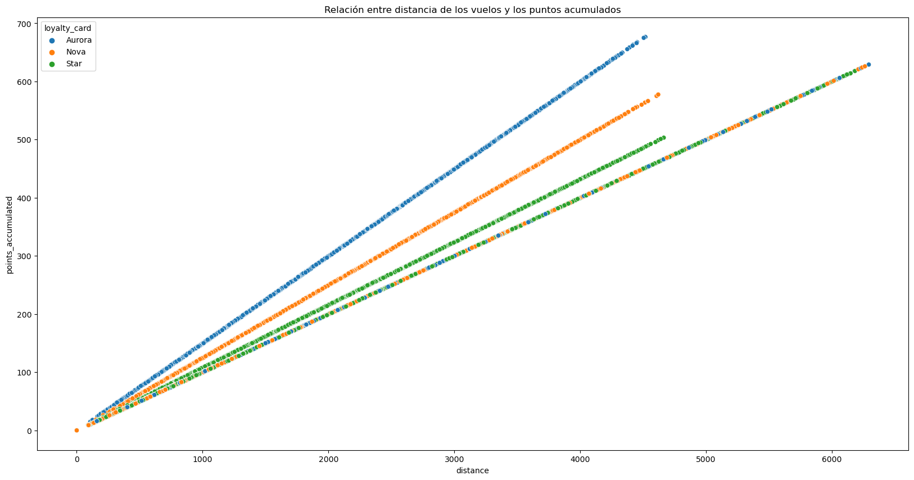
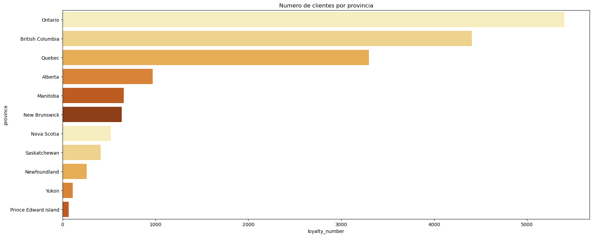
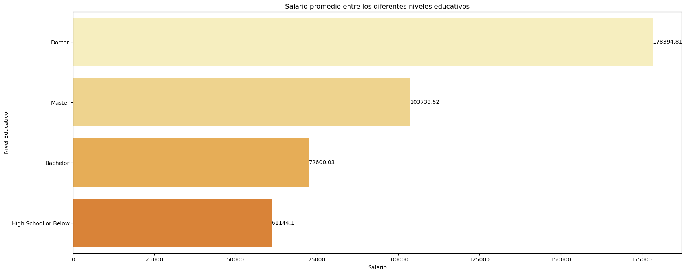
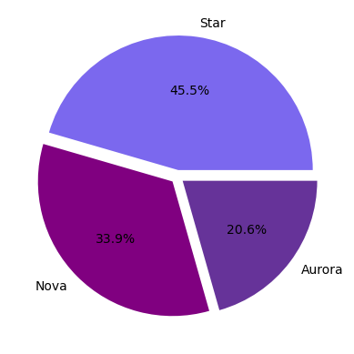
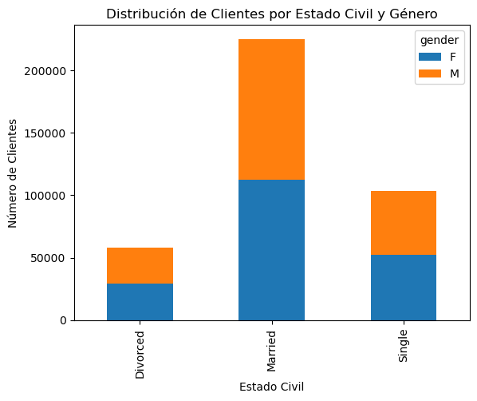

# Tareas realizadas

## Análisis, Limpieza y transformación
Estas son las transformaciones que se han realizado sobre los archivos recibidos:

- Customer FLight Activity.csv
    - **Duplicados**: Se han eliminado 1864 duplicados que no aportan nueva información sobre los registros
    - **Nombres de las columnas**: Se han homogenizado escribiéndolas en minúscula y cambiando los espacios por "_".
    - La tabla generada tras la ejecución de las transformaciones se ha guardado con el nombre : **Customer_Flight_Activity_Clean.csv**

- Customer Loyalty History.csv
    - **Country** : Se ha eliminado la columna ya que todos los registros son del mismo país: Canadá.
    - **Gender**: Se han reemplazado los nombres de los valores para evitar errores de escritura. Female pasa a ser F y Male M.
    - **Salary**: 
        - Se han detectado valores negativos y tras un análisis se ha llegado a la conclusión de que solo se trata de un error de scritura por lo que se han modificado manteniendo el valor en positivo.
        - Se han detectado varios nulos (25.33%). No se han imputado de momento para no pervertir los datos, pero se deja documentado para posteriores lo siguiente:
            - Coindicen con los registros cuyo valor en la columna de educación es : .
            - La columna salary tiene muchos valores atípicos por lo que, en caso de querer imputarlos, probablemente la mediana sea una opción más segura que la media.
        - **Cancelation Year y Cancellation Month** : Se han detectado una gran número de nulos en ambas columnas (87.7%) pero, debido a lo que trata el dato (cancelaciones), se ha asumido que no supone ningun error ya que, en el caso de no tener nulos, supondría que todos los clientes han cancelado sus cuentas.
            - Se recomienda gestionar estos datos en una tabla aparte en la base de datos.

    - **Nombres de las columnas**: Se han homogenizado escribiéndolas en minúscula y cambiando los espacios por "_".

    - La tabla generada tras la ejecución de las transformaciones se ha guardado con el nombre : **Customer_Loyalty_History_Clean.csv**

-Se han unificado ambas tablas (tras realizar las transformaciones) y el resultado se ha guardado con el nombre : **Customer_Unified_Table**.csv

## Visualizaciones

### 1. ¿Cómo se distribuye la cantidad de vuelos reservados por mes durante el año?

- Interpretación de la gráfica:
Se ve la misma distribución de vuelos resrvados en ambos años por lo que podemos suponer que es la norma, aunque las cantidades puedan variar. Los primeros meses del año se reservan pocos vuelos (podría deberse a la cuesta de enero o un descanso tras las navidades). Durante el año hay 3 picos en los que sube la reseva de vuelos en marzo  julio y diciembre siendo la de julio la más alta con mucha diferencia (empieza a crecer desde abril llegando al pico en julio para bajar tras este). Los picos coinciden con fechas destacadas por las vacaciones, el de marzo, que no es un pico demasiado alto con las vacaciones de primavera, el de julio con el verano y el de diciembre (bastante alto también) con las navidades.

### 2. ¿Existe una relación entre la distancia de los vuelos y los puntos acumulados por los clientes?

- Interpretación de la gráfica:
Hay una relación clara en la que a mayor distancia, mayor es la cantidad de puntos acumulado. Al ver que se forman 4 líneas muy definidas he pensado que debia haber alguna condicion establecida detrás de cada una de ellas y he confirmado que se trata de 'loyalty card' y que según el tipo la cantidad de puntos acumulados por la misma distancia es diferente.

### 3. ¿Cuál es la distribución de los clientes por provincia o estado?

- Interpretación de la gráfica:
La mayoría de clientes se encuentran en los tres estados más poblados de Canada (Ontario, Quebec y Columbia Británica), destacando sobre todas Ontario que tiene de lejos la población más alta con casi 16 millones de habitantes, lo que tiene sentido. Llama la atención que Columbia Británica esté por encima de Quebec, eso sí, ya qye tiene mucha menor población.

### 4. ¿Cómo se compara el salario promedio entre los diferentes niveles educativos de los clientes?

- Interpretación de la gráfica:
A mayor nivel educativo mayor es el promedio del salario. Siguiendo esta teoría podemos suponer que la columna de 'college', que no hemos podido analizar ya que no tenemos ningún dato de salario ene ste grupo, debería estar entre Bachelor y Master y, por lo tanto, tener un salario medio entre 72474.44 y 103733.52 pero no creo que tengamos la suficiente seguridad para afirmarlo.

### 5. ¿Cuál es la proporción de clientes con diferentes tipos de tarjetas de fidelidad?

- Interpretación de la gráfica:
La tarjeta más popular es la Star, seguida de la Nova y, por último, Aurora. Esto encaja con lo mostrado en el gráfico del segundo ejercicio en el que se mostraban los puntos obtenidos por distancia realizada mostrando una clara diferencia dependiendo de la tarjeta de lealtad, por lo que sabemos que Aurora es la tarjeta que mejores condiciones ofrece por lo tanto, probablemente, la más difícil de conseguir y, como muestra este último gráfico, la que menos clientes tienen (no sabemos cómo se consiguen las tarjetas, si hay que pagar suponemos que es la más cara, pero podría deberse a los años viajando con la compañía y en ese caso probablemente esta sería la que más años exige o cualquier otro tipo de condición). Lo mismo ocurre con los otros dos tipos de tarjetas, a mejores condiciones, menor es la cantidad de clientes que la tiene.

### 6. ¿Cómo se distribuyen los clientes según su estado civil y género?

- Interpretación de la gráfica:
La gran mayoría de los clientes están casados y casadas. El segundo estado civil más abitual es soltero y soltera pero está muy lejos del primero (menos de la mitad) y, por último están los divorciados y divorciadas. En cuanto al género no hay mucha diferencia ya que en ambos grupos están bastante repartidos a la mitad aproximadamente por lo que no es un factor que condicione al estado civil. 

## A/B Testing 
Se ha pedido analizar si existen diferencias significativas en el número de vuelos reservados según el nivel educativo de los clientes. 

Se han separado los clientes en dos grupos por su nivel educativo:
    - Grupo A : Universitarios (Valores: College, Master y Doctor)
    - Grupo B : No universitarios (Valores: High School or Below y Bachelor)

Tras un análisis de los datos, se ha aplicado la **Prueba U de Mann-Whitney** y se ha concluido que hay una diferencia significativa entre los dos grupos. Por lo tanto, podemos afirmar que hay una diferencia significativa entre grupos y que el nivel de educación afecta a la cantidad de vuelos reservados.

